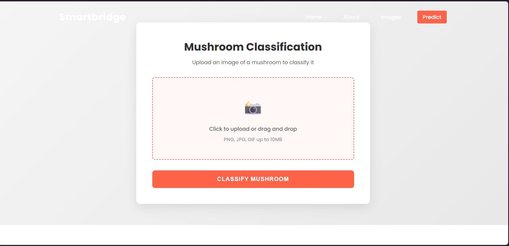
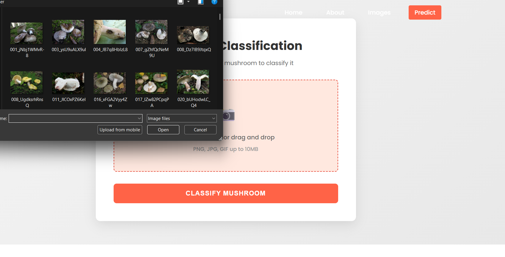
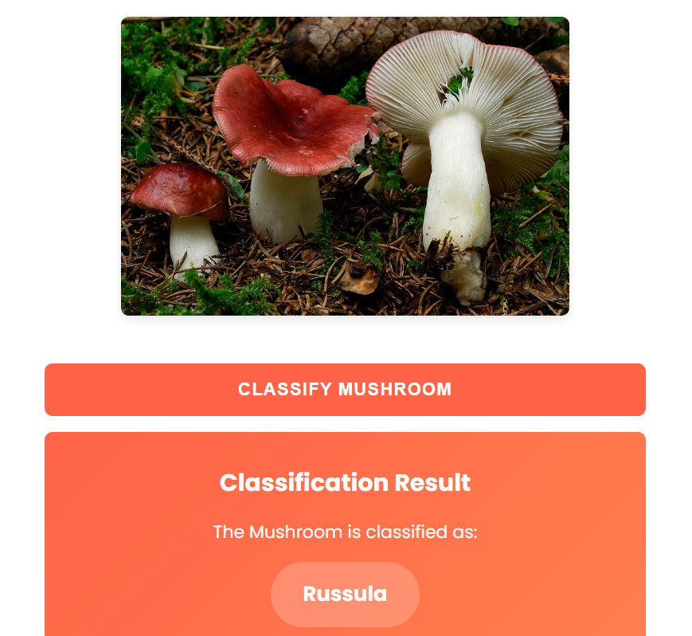
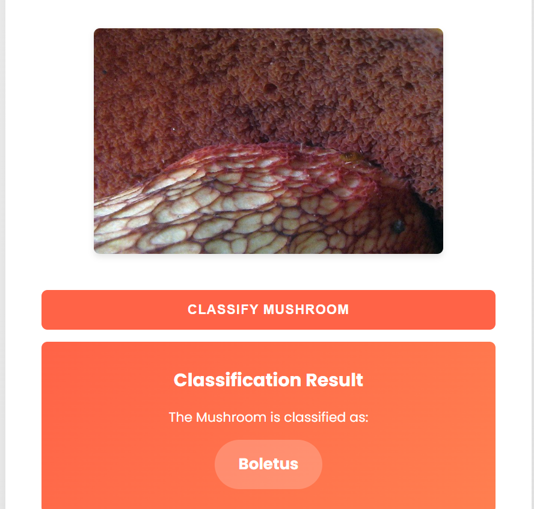
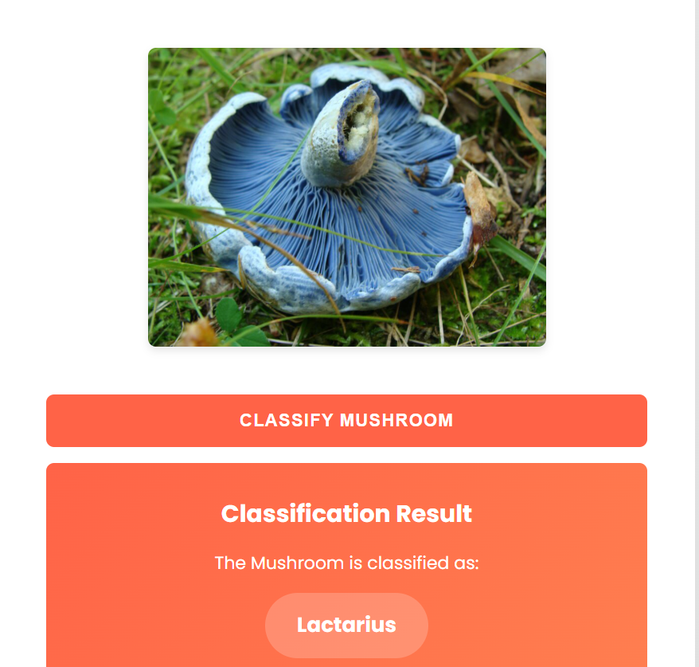

# 🍄 Mushroom Classification using Deep Learning

Mushroom Classifier is a deep learning-based image classification project that identifies different types of mushrooms using a Convolutional Neural Network (CNN). The system analyzes mushroom images and predicts their class with high accuracy. This project demonstrates practical implementation of computer vision and deep learning concepts.

🚀 Features

- Deep Learning Model built using CNN
- Image classification of multiple mushroom classes
- Dataset preprocessing and augmentation
- Model training and evaluation
- Single image prediction
- Easy-to-use testing workflow

## 🖼️ Web Application Interface
### Prediction Page

### Upload Page

### Classification Results

🛠️ Installation

## Prerequisites
- Python 3.8+
- TensorFlow / Keras
- Numpy
- Pandas
- Flask
- Anaconda
- Google Colab or Local Python Environment

## Steps

### Clone Repository
git clone https://github.com/kajalsankapal/Uncovering the Hidden Treasures of the Mushroom Kingdom: A Classification Analysis.git

Create a Virtual Environment

python -m venv venv310 source venv310/bin/activate # On Windows: venv310\Scripts\activate

### Install Dependencies
pip install -r requirements.txt
Open anaconda prompt.
Type “pip install tensorflow” and click enter.
Type “pip install keras” and click enter.
Type “pip install Flask” and click enter.

Run the Application

python app.py

Access the application at http://localhost:5000.

### Run the Project
1. Open the notebook in Google Colab or VS Code
2. Upload Dataset folder
3. Train the model
4. Run testing cell to predict mushroom class

🧠 Model Details

- Architecture: Convolutional Neural Network (CNN)
- Framework: TensorFlow & Keras
- Image Preprocessing: Resizing, Normalization
- Dataset Split: Train / Test folders

📁 Project Structure

## 📁 Project Structure

AI-MUSHROOM-CLASSIFICATION/
│
├── Dataset/
│   ├── train/
│   └── test/
│
├── Flask/
│   ├── static/
│   ├── templates/
│   ├── uploads/
│   ├── venv310/
│   ├── app.py
│   └── Mushroom Classification Model.h5
│
├── IBM Files/
│   ├── Mushroom_Classification_using_InceptionV3.ipynb
│   └── Mushroom-Classification-Model.tgz
│
├── Output/
│   ├── Final-Result1.png
│   ├── Final-Result2.png
│   ├── Final-Result3.png
│   ├── Image-upload.png
│   └── Predict.png
│
├── Training files/
│   ├── Mushroom_Classification_Model.h5
│   └── Mushroom_Classification_using_InceptionV3.ipynb
│
├── Mushroom Classification Final Report.pdf
└── README.md

📊 Results

- Model trained on labeled mushroom images
- Achieved good accuracy on test dataset
- Supports real-time prediction

🎯 Future Improvements

- Deploy using Flask Web App
- Add more mushroom species
- Improve accuracy with Transfer Learning

👩‍💻 Author

Kajal Sankapal  
AIML Student | Deep Learning Enthusiast
